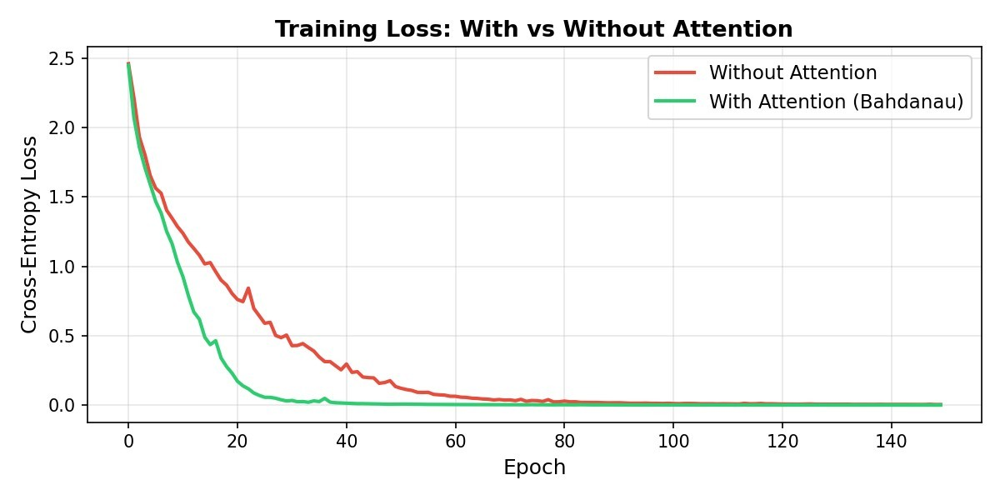

# 📘 Assignment 6  
## Encoder–Decoder Models with and without Attention  

## 📌 Objective  
To compare Encoder–Decoder models with and without Attention mechanism.  

## 📂 Project Structure  
Assignment-6/  
│── Outputs/  
│   ├── Attention Heatmaps.jpg  
│   ├── Performance bar chart.jpg  
│   ├── Training_loss.jpg  
│── README.md  
│── report.pdf  
│── code.ipynb  

## 🧪 Models Implemented  
- Encoder–Decoder (Without Attention)  
- Encoder–Decoder (With Attention)  

## 📊 Results Summary  
- Attention improves context understanding  
- Better handling of long sequences  
- Lower training loss and better performance  

## 📷 Outputs  

Path: Outputs/Attention Heatmaps.jpg  

Path: Outputs/Performance bar chart.jpg  

Path: Outputs/Training_loss.jpg  

## 🧾 Conclusion  
Attention mechanism enhances performance and is crucial for modern sequence models.
